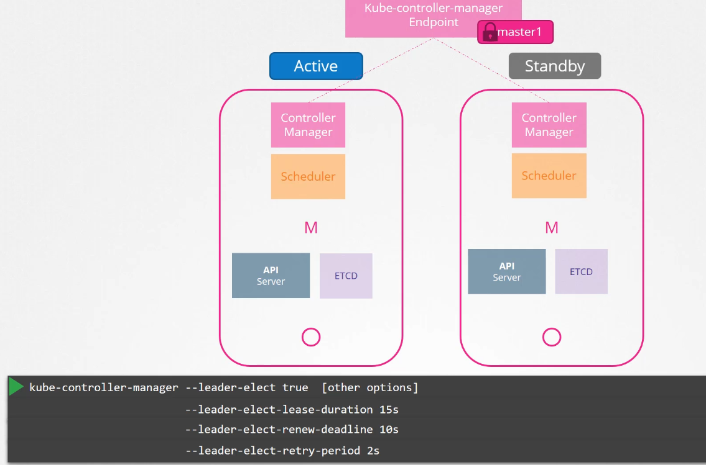
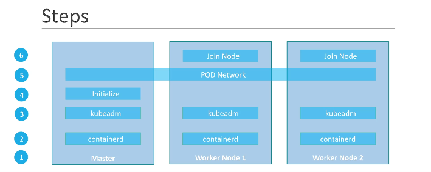

Through Leader elect process, one of the controller manager gains lock on the controller manager endpoint. So that they dont run in parallel.

Steps to setup a kubernetes cluster.

    Have multiple vms provisioned
    Install container runtime on all hosts. Eg - containerd
    Install kubeadm
    Initialize the master server
    Establish pod network
    join nodes

Install VMware and vagrant. Then use vagrant to setup the vms.

vagrant up -> helps to setup vms.

Install a container runtime using https://kubernetes.io/docs/setup/production-environment/container-runtimes/

# Forwarding IPv4 and letting iptables see bridged traffic
Execute the below mentioned instructions on all nodes:

    cat <<EOF | sudo tee /etc/modules-load.d/k8s.conf
    overlay
    br_netfilter
    EOF

    sudo modprobe overlay
    sudo modprobe br_netfilter

    # sysctl params required by setup, params persist across reboots
    cat <<EOF | sudo tee /etc/sysctl.d/k8s.conf
    net.bridge.bridge-nf-call-iptables  = 1
    net.bridge.bridge-nf-call-ip6tables = 1
    net.ipv4.ip_forward                 = 1
    EOF

    # Apply sysctl params without reboot
    sudo sysctl --system

Verify that the br_netfilter, overlay modules are loaded by running the following commands:

    lsmod | grep br_netfilter
    lsmod | grep overlay

Verify that the net.bridge.bridge-nf-call-iptables, net.bridge.bridge-nf-call-ip6tables, and net.ipv4.ip_forward system variables are set to 1 in your sysctl config by running the following command:

    sysctl net.bridge.bridge-nf-call-iptables net.bridge.bridge-nf-call-ip6tables net.ipv4.ip_forward

Now go to the runtime you are interested in and follow the steps.

Click on the getting started with containerd(our runtime). Choose option 2 using apt install and select linux distribution. Eg. Ubuntu and follow the steps.

Now come back to container runtime page, you have cgroup drivers.

cgroup drivers

    On Linux, control groups are used to constrain resources that are allocated to processes.

    Both the kubelet and the underlying container runtime need to interface with control groups to enforce resource management for pods and containers and set resources such as cpu/memory requests and limits. To interface with control groups, the kubelet and the container runtime need to use a cgroup driver. It's critical that the kubelet and the container runtime use the same cgroup driver and are configured the same.

There are two cgroup drivers available:

    cgroupfs
    systemd

To check for init system, 

    ps -p 1  -> gives process with id 1

Configuring the systemd cgroup driver

    To use the systemd cgroup driver in /etc/containerd/config.toml with runc, set

    [plugins."io.containerd.grpc.v1.cri".containerd.runtimes.runc]
    [plugins."io.containerd.grpc.v1.cri".containerd.runtimes.runc.options]
        SystemdCgroup = true

Delete all the info in config.toml file and paste this.

Restart the container runtime.

    sudo systemctl restart containerd

Install Kubeadm, kubelet and kubectl

*********** kubeadm will not install or manage kubelet or kubectl for you, so you will need to ensure they match the version of the Kubernetes control plane you want kubeadm to install for you. If you do not, there is a risk of a version skew occurring that can lead to unexpected, buggy behaviour. However, one minor version skew between the kubelet and the control plane is supported, but the kubelet version may never exceed the API server version. For example, the kubelet running 1.7.0 should be fully compatible with a 1.8.0 API server, but not vice versa.

# Steps to follow
Update the apt package index and install packages needed to use the Kubernetes apt repository:

    sudo apt-get update
    sudo apt-get install -y apt-transport-https ca-certificates curl

Download the Google Cloud public signing key:

    curl -fsSL https://packages.cloud.google.com/apt/doc/apt-key.gpg | sudo gpg --dearmor -o /etc/apt/keyrings/kubernetes-archive-keyring.gpg

Add the Kubernetes apt repository:

    echo "deb [signed-by=/etc/apt/keyrings/kubernetes-archive-keyring.gpg] https://apt.kubernetes.io/ kubernetes-xenial main" | sudo tee /etc/apt/sources.list.d/kubernetes.list

Update apt package index, install kubelet, kubeadm and kubectl, and pin their version:

    sudo apt-get update
    sudo apt-get install -y kubelet kubeadm kubectl
    sudo apt-mark hold kubelet kubeadm kubectl

**********Both the container runtime and the kubelet have a property called "cgroup driver", which is important for the management of cgroups on Linux machines.

# Using kubeadm to create cluster

## Initializing your control-plane node

The control-plane node is the machine where the control plane components run, including etcd (the cluster database) and the API Server (which the kubectl command line tool communicates with).

    (Recommended) If you have plans to upgrade this single control-plane kubeadm cluster to high availability you should specify the --control-plane-endpoint to set the shared endpoint for all control-plane nodes. Such an endpoint can be either a DNS name or an IP address of a load-balancer.

    Choose a Pod network add-on, and verify whether it requires any arguments to be passed to kubeadm init. Depending on which third-party provider you choose, you might need to set the --pod-network-cidr to a provider-specific value. See Installing a Pod network add-on.
    
    (Optional) kubeadm tries to detect the container runtime by using a list of well known endpoints. To use different container runtime or if there are more than one installed on the provisioned node, specify the --cri-socket argument to kubeadm. See Installing a runtime.
    
    (Optional) Unless otherwise specified, kubeadm uses the network interface associated with the default gateway to set the advertise address for this particular control-plane node's API server. To use a different network interface, specify the --apiserver-advertise-address=<ip-address> argument to kubeadm init. To deploy an IPv6 Kubernetes cluster using IPv6 addressing, you must specify an IPv6 address, for example --apiserver-advertise-address=2001:db8::101

To initialize the node, run

    sudo kubeadm init --por-network-cidr=10.244.0.0/16 --apiserver-advertise-address=<Ip of the node, find it out using ip add>

### Output of kubeadm init

    Your Kubernetes control-plane has initialized successfully!

    To start using your cluster, you need to run the following as a regular user:

    mkdir -p $HOME/.kube
    sudo cp -i /etc/kubernetes/admin.conf $HOME/.kube/config
    sudo chown $(id -u):$(id -g) $HOME/.kube/config

    You should now deploy a Pod network to the cluster.
    Run "kubectl apply -f [podnetwork].yaml" with one of the options listed at:
    /docs/concepts/cluster-administration/addons/

    You can now join any number of machines by running the following on each node
    as root:

    kubeadm join <control-plane-host>:<control-plane-port> --token <token> --discovery-token-ca-cert-hash sha256:<hash>

# Installing a pod network

Go to https://kubernetes.io/docs/concepts/cluster-administration/addons/

Select a network addon, eg . Weave net and follow the steps.

********Set the same IP_ALLOC for the weave net as you have given for the pod-network-cidr in kubeadm init. Set the IPALLOC_RANGE env on weave container in daemonset.

## Now to add other nodes to the cluster, run below command from the output of kubeadm init.

    kubeadm join --token <token> <control-plane-host>:<control-plane-port> --discovery-token-ca-cert-hash sha256:<hash>

Now, you can taint control plane node so that no pods get scheduled on it.

