To check the status and history of deployment.

    kubectl rollout status deployment/deployment-name  

Two types of deployment strategy.

Recreate Strategy - take down all older versions and create new ones all at once

Rolling Update - It takes own one pod and creates a new one. It does it one by one.

Whenever you make changes to new deployment definition and create it again. It follows rolling update.

To undo a rollout,

    kubectl rollout undo deployment/deployment-name

List of commands.

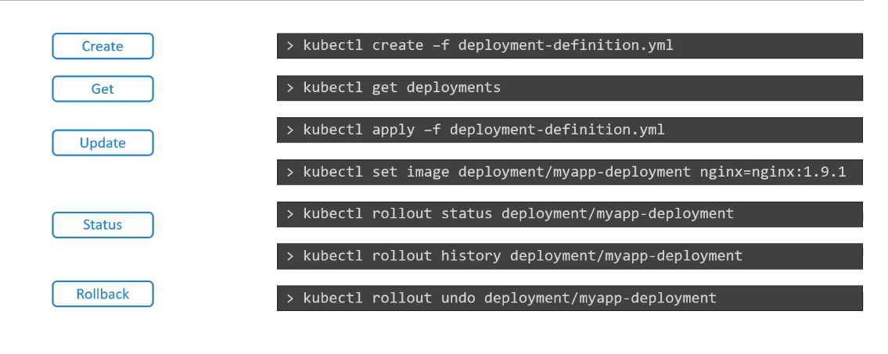

Configure Applications

In a DockerFile,  CMD command is the first command that runs in a container. 

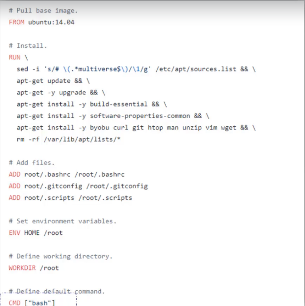

You can append the command to docker run to replace the CMD

    docker run image Command
    docker run ubuntu sleep 5

Or you can create your own image from base image and thenn add your own CMD. Below is the new DockerFile

    FROM BASE_IMAGE

    CMD sleep 5

CMD can be written in 2 forms. 

    CMD command param1
    CMD ["command" "param1"]

but, below is a mistake.

    CMD ["sleep 5"]

LEts say, you create a new image called ubuntu-sleeper. Now if you run the docker, it sleeps for 5 seconds and exits. But to change the param value for the CMD, you can append the command with the docker run command.

    docker run ubuntu-sleeper sleep 10

But we should be able to do it without mentioning the sleep command again. So to do this, we use ENTRYPOINT command.

ENTRYPOINT takes an executable program as input.

    ENTRYPOINT ["sleep"]

Now, if you run the docker with value 10.

    docker run ubuntu-sleeper 10

It runs, sleep 10. the command line parameters gets appended to the entrypoint command. Now if you dont give any command line parameter, you will get operand missing error.

To have a default param value, we use CMD along with ENTRYPOINT. CMD will get appended to the ENTRYPOINT instruction.

    FROM BASE_IMAGE

    ENTRYPOINT ["sleep"]

    CMD ["10"]

It does sleep 10. But if you want to change the entrypoint during runtime, do below.

    docker run --entrypoint new_program_for_entrypoint image_name params
 
    docker run --entrypoint sleep2.0 ubuntu-sleeper 10

 
Command and Arguments for pods

Create a pod using the ubuntu-sleeper pod. Anything that is appended to docker run command goes to the args property. 

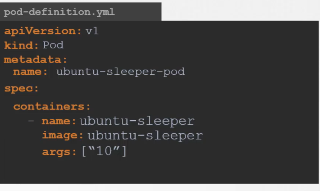

The command field overwrites the entrypoint and args overwrites the CMD.

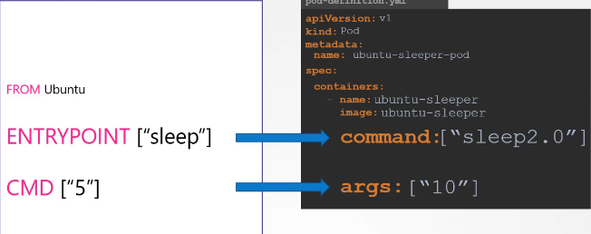

ConfigMaps

You can create ConfigMaps using imperative and declarative ways.
Imperative Way

    kubectl create configmap config-name --from-literal=key=value

    kubectl create configmap app-config --from-literal=color=blue

Through a file.

    kubectl create configmap config-name --from-file=path-to-file

Declarative Way, through a definition file.

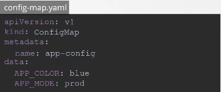

Below is how you add configmap to a pod.

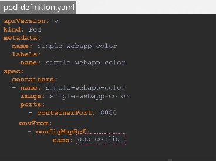

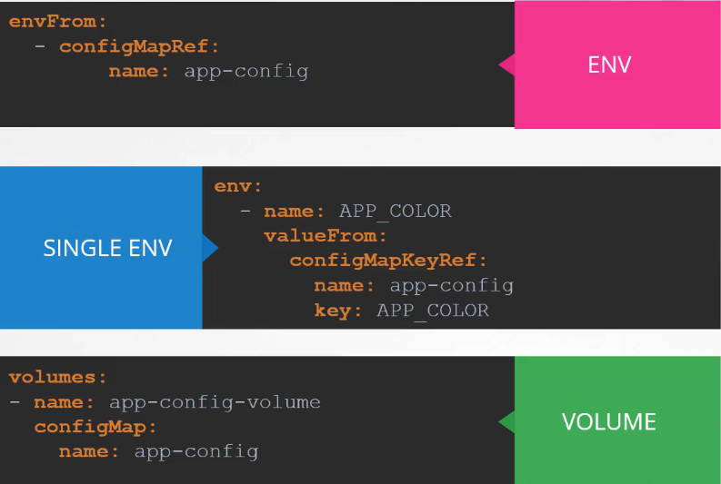

Secrets

Imperative way

    kubectl create secret generic secret-name --from-literal=key=value

    kubectl create secret generic app-secret --from-literal=DB_HOST=mysql

From file.

        kubectl create secret generic secret-name --from-file=path-to-file

Encode text to base64 on linux

    echo -n "mysql" | base64

Then use these values in the secretfile. 

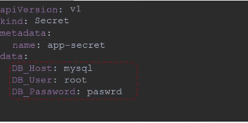

    kubectl describe secrets -- doesnt show the values,, only keys

    kubectl get secret secret-name -o yaml  --shows the encoded values

To decode the value,

    echo -n "encoded-value" | base64 --decode

Configuring secret to a pod.

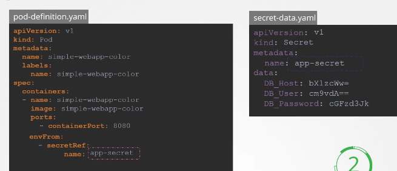

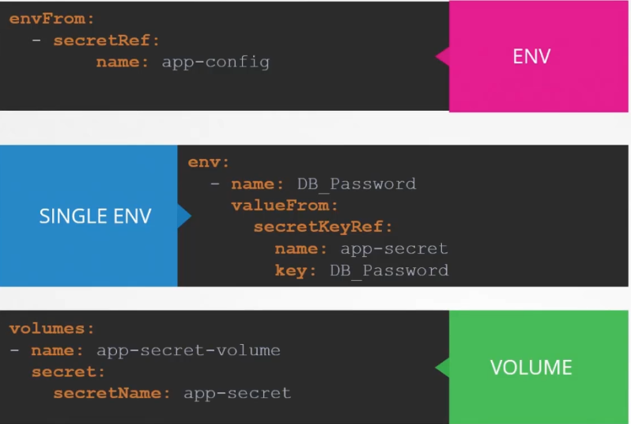

If you have to mount a secret as a volume in a pod, each attribute is created as a file and its value as its content.

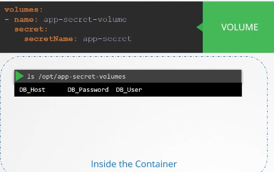

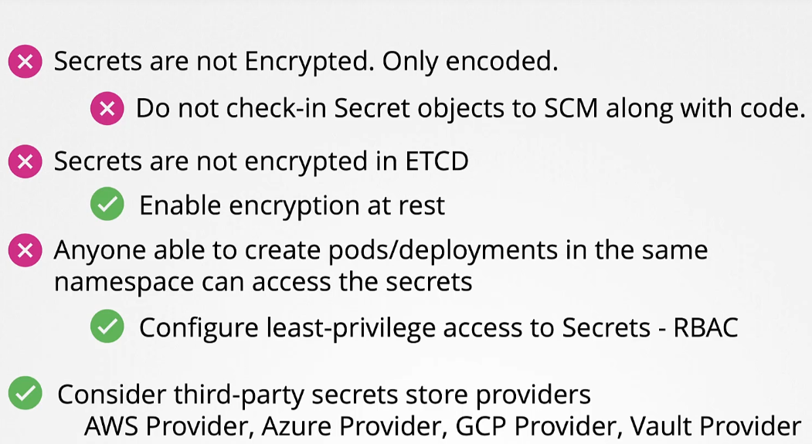

