Switching and Routing

We have 2 computers in a network. we connect them to a switch through a interface. We can see this interface for the host. Which is usually eth0.

        ip link 

We can assign ip addresses to the links. Assume that the network is 192.168.1.0/24

    ip addr add 192.168.1.10/24 dev eth0

.png)

How the systemB with IP address 192.168.1.11 communicate to systemc in other network with ip address 192.168.2.10.

This is when a router comes in. It helps connects two networks. As it connects to two different networks, it gets 2 ips at minimum.

you can use route command to check the routing table.

To configure a gateway to reach systems on 192.168.2.0 network, we use the following command.

    ip route add 19.168.2.0/24 via 192.168.1.1

To add default gateway,

    ip route add default via 192.168.2.1
    ip route add 0.0.0.0 via 192.168.2.1

Both are same.

Whether a host can forward packets between interfaces is governed by below file.

    cat /proc/sys/net/ipv4/ip_forward

By default, the value in the file is 0. change it to 1. Means it is enabled.

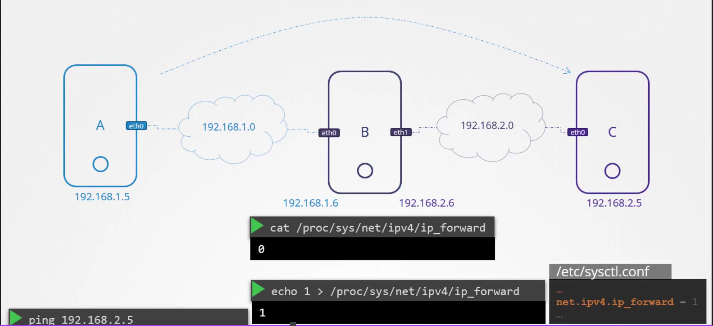

DNS

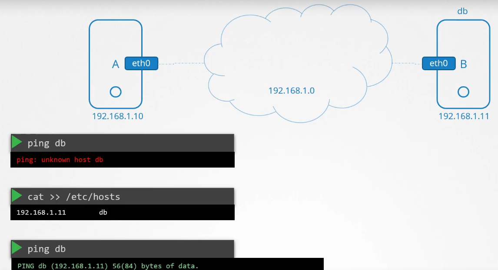

But it will become difficult to have so many entries for each host. So all of these entries are now managed centrally by a server called DNS Server.

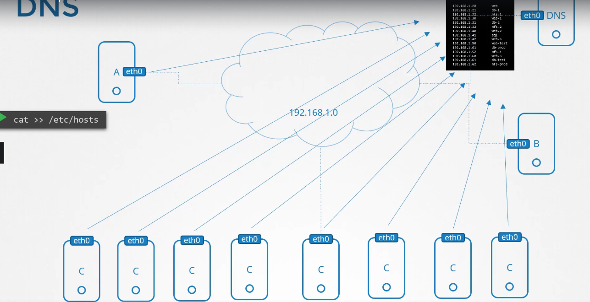

Now, we configure all the hosts to point to this server. That is done through /etc/resolv.conf file.

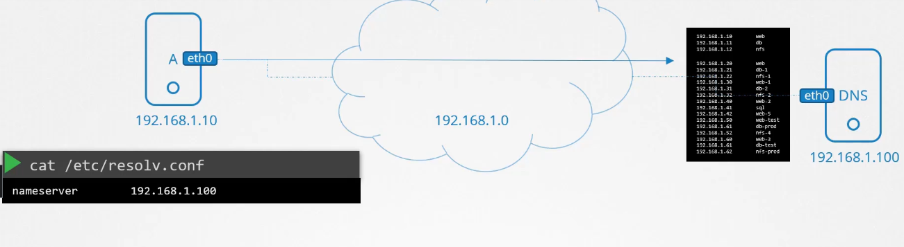

If you have different entries for same host "test" with different IP addresses in /etc/hosts and in DNS server. It checks locally and uses the IP address> If it doesnt find the address locally, it goes to DNS. However, we can change this order by changing the hosts details in "/etc/nsswitch.conf"

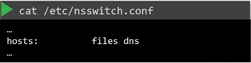

files refer to /etc/hosts. If you want to ping external systems like google.com, you can add new namesever in your /etc/resolv.conf file or you can add it in your DNS to forward any unknown IPs to a public name server(8.8.8.8).

**** nslookup and dig doesnt check for /ect/hosts. They only checks DNS server.

CoreDNS

In the previous lecture we saw why you need a DNS server and how it can help manage name resolution in large environments with many hostnames and Ips and how you can configure your hosts to point to a DNS server. In this article we will see how to configure a host as a DNS server.

We are given a server dedicated as the DNS server, and a set of Ips to configure as entries in the server. There are many DNS server solutions out there, in this lecture we will focus on a particular one – CoreDNS.

So how do you get core dns? CoreDNS binaries can be downloaded from their Github releases page or as a docker image. Let’s go the traditional route. Download the binary using curl or wget. And extract it. You get the coredns executable.

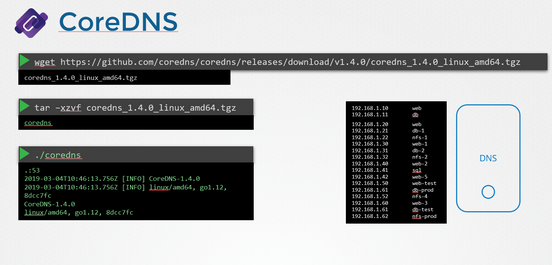

Run the executable to start a DNS server. It by default listens on port 53, which is the default port for a DNS server.

Now we haven’t specified the IP to hostname mappings. For that you need to provide some configurations. There are multiple ways to do that. We will look at one. First we put all of the entries into the DNS servers /etc/hosts file.

And then we configure CoreDNS to use that file. CoreDNS loads it’s configuration from a file named Corefile. Here is a simple configuration that instructs CoreDNS to fetch the IP to hostname mappings from the file /etc/hosts. When the DNS server is run, it now picks the Ips and names from the /etc/hosts file on the server.

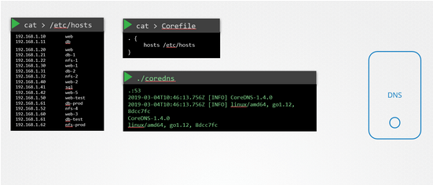

CoreDNS also supports other ways of configuring DNS entries through plugins. We will look at the plugin that it uses for Kubernetes in a later section.

Network Namespaces

Create new network namespace,

    ip netns add red
    ip netns add blue

    ip netns     -- lists all ns

    ip netns exec red ip link 
    ip -n red link               --- These executes the ip link command inside the red namsepace

Now to create a veth cable between these two namespaces. Use

    ip link add veth-red type veth peer name veth-blue

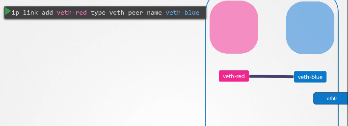

As shown in the image, it creates a virtual pipe or cable like connection. Now attach these veth to respective namespaces with below commands.

    ip link set veth-red netns red
    ip link set veth-blue netns blue
    
Add IP addresses to these namespaces using below commands.

    ip -n red addr add 192.168.15.1 dev veth-red
    ip -n blue addr add 192.168.15.2 dev veth-blue

Then you can turn on these veth interfaces.

    ip -n red link set veth-red up
    ip -n blue link set veth-blue up

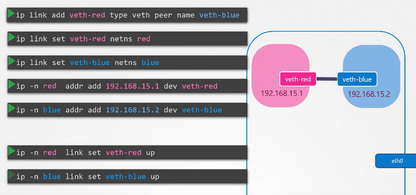

But its tough to do this if we have more interfaces.

Linux Bridge

To create a Bridge,

    ip link add v-net-0 type bridge

To make the bridge available,

    ip link set v-net-0 up

You can delete links using

    ip -n red link delete veth-red

When you delete one link, the other side link veth-blue also gets deleted automatically.

Now create new cables for each namespace.

    ip link add veth-red type veth peer name veth-red-br
    ip link add veth-blue type veth peer name veth-blue-br

Now attach these links to respective namespaces.

    ip link set veth-red netns red
    ip link set veth-red-br master v-net-0

    ip link set veth-blue netns blue
    ip link set veth-blue-br master v-net-0

Now add IP addresses to these namespaces or veth interfaces.

    ip -n red addr add 192.168.15.1 dev veth-red
    ip -n blue addr add 192.168.15.2 dev veth-blue

Then you can turn on these veth interfaces.

    ip -n red link set veth-red up
    ip -n blue link set veth-blue

Also add IP addr to the bridge.

    ip addr add 192.168.15.5 dev v-net-0

After you assign the IP to the bridge, which ia also an interface. you can ping any namespace from your host.

Docker Networking

In a host, you can create a isolated docker container with no network connection using,

    docker run --network none nginx

And you can connect to host network using,

    docker run --network host nginx

With this, if you are running an application on port 80 inside the container, you can access the same application on port 80 with localhost. And no other similar container can be run as it cant attached to the same host.

And a bridge is also created by docker called docker0.
So, whenever a new container is created, docker creates a new namespace for the container, adds a link (veth-red----veth-red-br) and attaches the link to the namespace and the docker bridge.

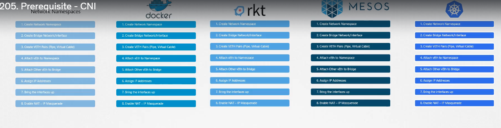

Container Networking Interface

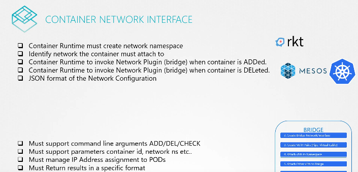

