TLS Basics

To generate public and private keys for ssh. 

    ssh-keygen

This generates public and private keys. 

We can also generate keys using openssl

    openssl genrsa -out my-bank.key 1024  -- This is the private key

    openssl rsa -in my-bank.key -pubout > mybank.pem  -- This is the public key

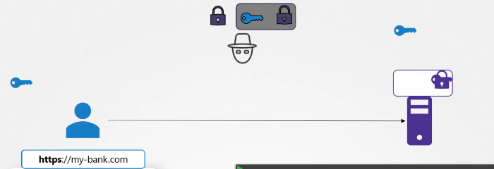

For the first time, a user access the server, server shares a public key with the user. When user receives this public key, he wil encrypt the symmetric key with the public key and send it to the server. Server then decrypts it with the private key it has and extracts the symmetric key. Now the symmertic key is used for further communication.

If the hacker can redirect or make you access a web page connected to his own server, your security is compramized. Because you will get the hacker's server public key and by the above process, you will share your symmetric key to the hacker.

This is solved using certificates.

 *******  you can only encrypt using a public key and decrypt using a private key and vise versa. But you cant do both encryption using one single key.

A authorized CA(Certificate Authority) signs the certificate signing request(CSR) (including its public key). These CAs public key is configured into your browser. First the server creates public and private keys. Then creates a CSR and asks the CA to verify and sign the CSR. CA also has a public and private key. Once CA verifies and signs the certificate by encrypting it with CAs public key, it is sent back to the server. Whenever a user access the server, server sends the signed certificate and user decrypts the certificate using CAs public key. It gets the public key of the server. Now it encrypts the symmetric key using the server's public key and sends it to ther server. Now server decrypts it using private key and gets the symmetric key. Noe the communication is done using symmetric key.

Certificates in Kubernetes

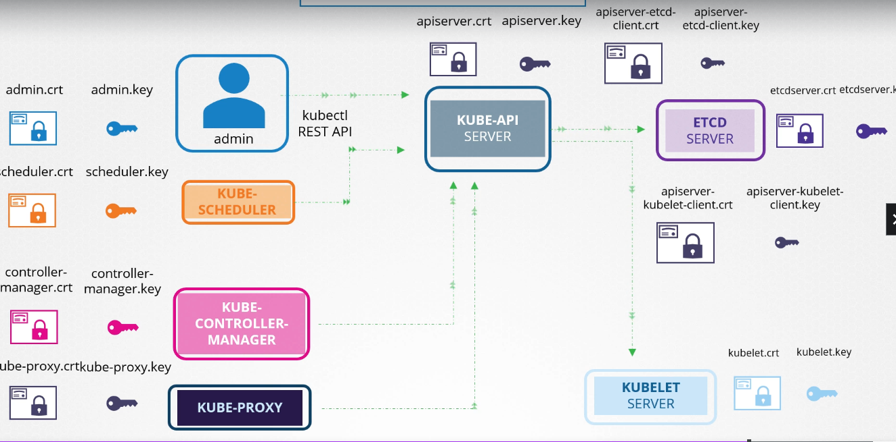

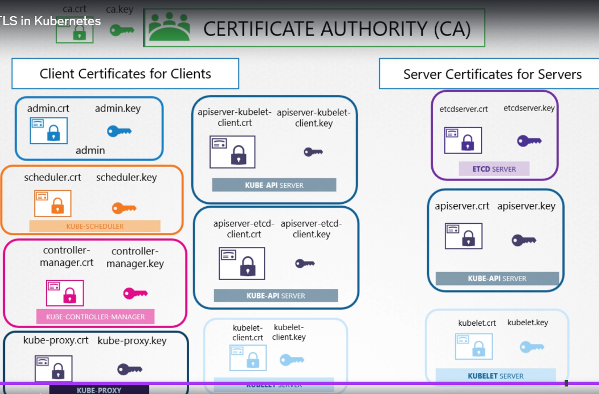

Certificate Creation in Kubernetes

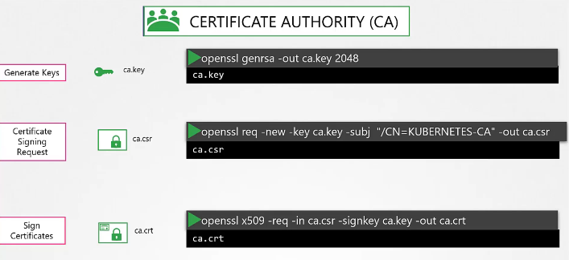

Certificate authority self sign the CAs CSR.

Certificates for Admin user using CA 

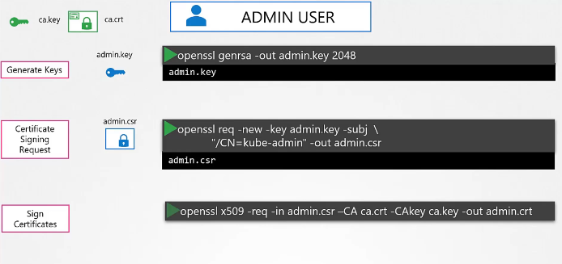

you can use the certificates to ping api server instead of username and password.

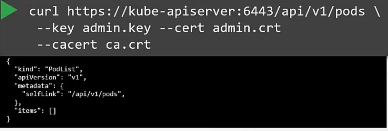

But you can configure these details in kube-config file.

To raise a CSR, encode the csr and place in the request file.

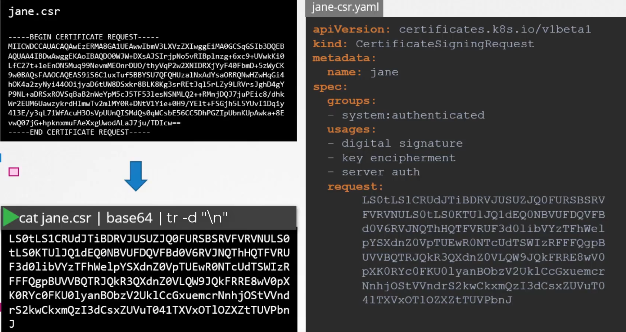

    kubectl get csr  -- to see the csr requests

    kubectl certificate approve csr-name  -- to approve the CSR

The Kube controller manager does the CA approval. It uses cluster-signing-cert and key to sign the CSR.

We can access the api both ways.

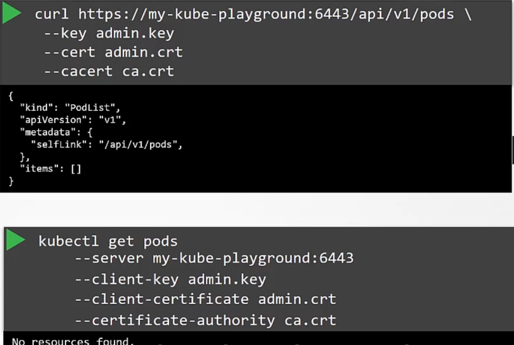

You can also add all these configurations in kubeconfig file. A kubectl has a default kubeconfig file, thats why you dont enter it yourself.

The kubeconfig file template.

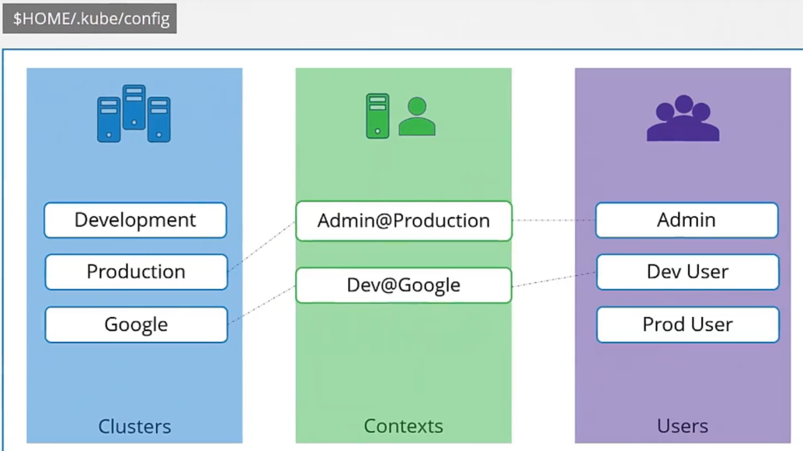

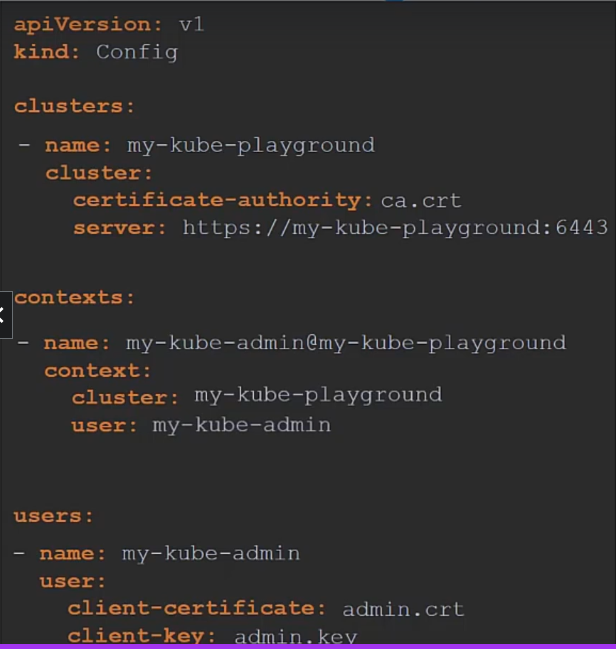

We can add the current-context in the config file.
    
    kind: Config
    current-context: context-name

We can see the default config file by

        kubectl config view

To update context, 

    kubectl config use-context new-context-name

This changes are actually reflected in config file.

You can also add namespace to context in config file. So, when you switch to that context, you also switch the namespace

You can also add certificate-authority-data and add the base64 encoded certificate directly.

Authorization Modes

Node, Attribute Based Access Controls, Role Based Access Controls, Webhooks, AlwaysAllos, AlwaysDeny

---RBAC---

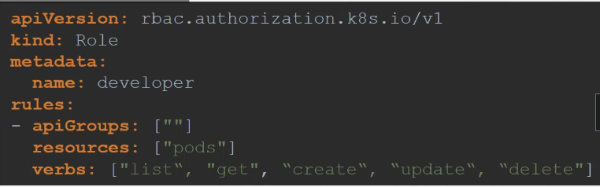

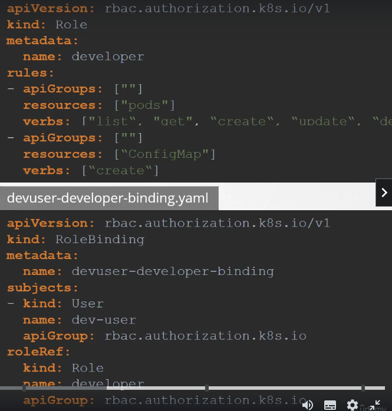

you can mention a namespace in the metadata of role definition file.

You can check if you can do certain task by below commands

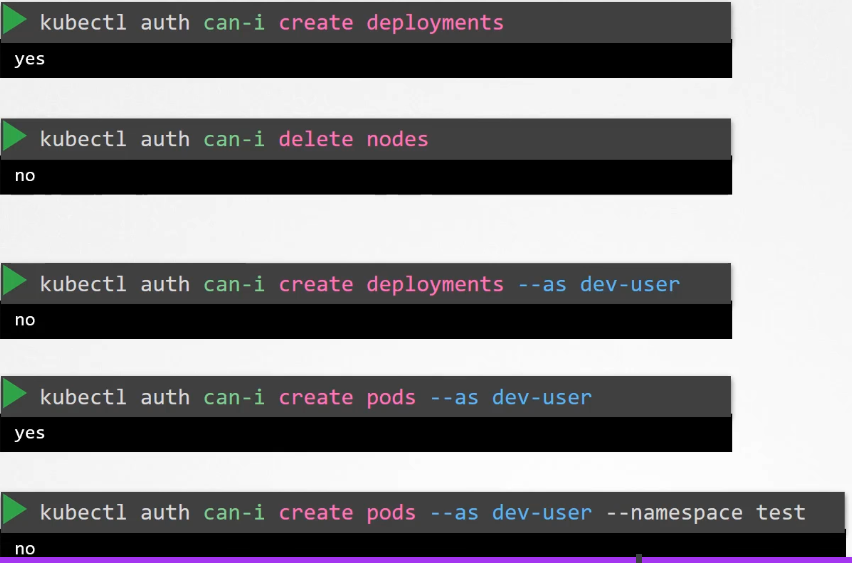

You can add resourceNames field and add names of resourece, for example pods and give access to those specific pods.

Create Roles and RoleBindings imperatively.

    kubectl create role developer --namespace=default --verb=list,create,delete --resource=pods

    kubectl create rolebinding dev-user-binding --namespace=default --role=developer --user=dev-user

ClusterRoleBinding

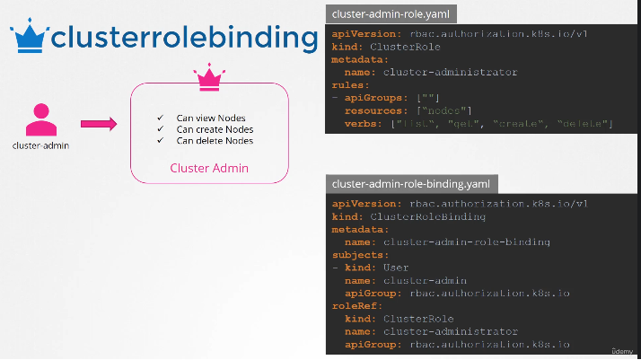

You can also create clusterroles on namespaced resources also.

Service Account

    kubectl create serviceaccount serviceaccount-name

PRivate Docker Repo

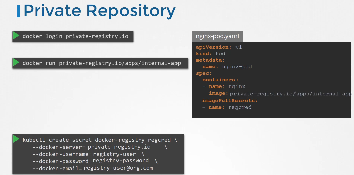

